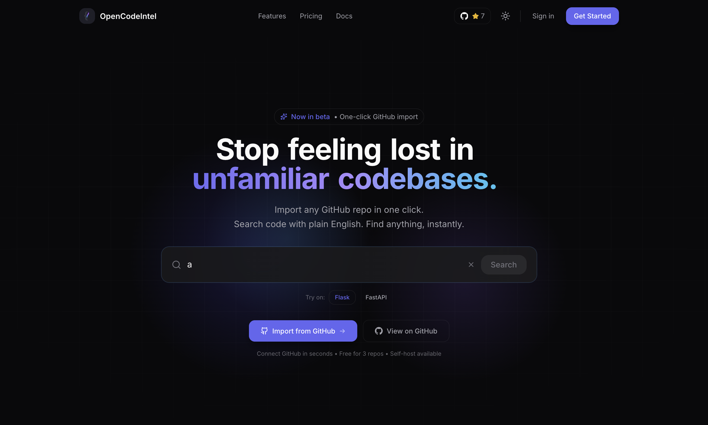

<p align="center">
  
</p>

<h1 align="center">OpenCodeIntel</h1>

<p align="center">
  <strong>Stop feeling lost in unfamiliar codebases.</strong><br/>
  Semantic code search powered by AI. Find anything, instantly.
</p>

<p align="center">
  <a href="https://opencodeintel.com"><strong>Try it Free</strong></a>
  &nbsp;&nbsp;·&nbsp;&nbsp;
  <a href="#quick-start">Self-Host</a>
  &nbsp;&nbsp;·&nbsp;&nbsp;
  <a href="./docs">Docs</a>
  &nbsp;&nbsp;·&nbsp;&nbsp;
  <a href="./CONTRIBUTING.md">Contribute</a>
</p>

<p align="center">
  <a href="https://github.com/OpenCodeIntel/opencodeintel/actions/workflows/ci.yml">
    
  </a>
  <a href="https://github.com/OpenCodeIntel/opencodeintel/blob/main/LICENSE">
    
  </a>
  <a href="https://github.com/OpenCodeIntel/opencodeintel/stargazers">
    
  </a>
</p>

<br/>

<p align="center">
  
</p>

---

## The Problem

You know the feeling. Day one on a new codebase. Deadline in two weeks.

You need to find "where authentication happens" but the function is called `validateSessionToken()`. Grep for "auth" and you get nothing. You spend 20 minutes clicking through files, afraid to touch anything because you don't know what might break.

Traditional code search matches text, not meaning. You have to already know what you're looking for to find it.

---

## The Solution

OpenCodeIntel understands your code the way you do. Search by what code *does*, not what it's named.

```text
You search: "authentication logic"
It finds:   validateSessionToken(), checkJWT(), authMiddleware.ts
```

```text
You search: "where we handle payments"  
It finds:   stripe/checkout.ts, processRefund(), PaymentService
```

```text
You search: "error handling"
It finds:   catch blocks, onError(), processFailure()
```

No regex. No exact matches. Just describe what you're looking for.

---

## Features

### Semantic Code Search
Search by meaning, not keywords. Find that function even when you don't know its name.

### Dependency Graph  
Visualize how your files connect. Understand the architecture at a glance.

### Impact Analysis
About to change `auth.ts`? Know exactly what breaks before you touch it.

### Code Style Intelligence
Understand your team's patterns. snake_case or camelCase? How are errors handled? Match conventions instantly.

### Works with Claude (MCP)
Connect as an MCP server. Your AI assistant gets real context about your codebase, not just the file you have open.

---

## Quick Start

### Hosted (Fastest)

Go to [opencodeintel.com](https://opencodeintel.com), connect your GitHub, and start searching in under a minute.

### Self-Hosted

```bash
git clone https://github.com/OpenCodeIntel/opencodeintel.git
cd opencodeintel

cp .env.example .env
# Add your OpenAI + Pinecone API keys

docker compose up -d
```

Open [localhost:3000](http://localhost:3000). Done.

<details>
<summary><strong>Manual setup (without Docker)</strong></summary>

**Requirements:** Python 3.11+, Node.js 20+, Redis

```bash
# Backend
cd backend
python -m venv venv && source venv/bin/activate
pip install -r requirements.txt
python main.py

# Frontend (new terminal) - MUST use Bun!
cd frontend
bun install && bun run dev
```

</details>

<details>
<summary><strong>Connect to Claude Desktop (MCP)</strong></summary>

Add to your Claude Desktop config (`~/Library/Application Support/Claude/claude_desktop_config.json`):

```json
{
  "mcpServers": {
    "opencodeintel": {
      "command": "python",
      "args": ["/path/to/opencodeintel/mcp-server/server.py"],
      "env": {
        "BACKEND_API_URL": "http://localhost:8000",
        "API_KEY": "your-api-key"
      }
    }
  }
}
```

See [full MCP setup guide](./docs/mcp-setup.md)

</details>

---

## Why I Built This

I got tired of grep.

Every time I joined a new project or inherited a codebase, I spent hours just figuring out where things lived. The original authors were gone. The docs were outdated. And I was scared to change anything because I couldn't see what depended on what.

I wanted code search that actually understood what code does. Not pattern matching on text. Something that could answer "where do we handle user sessions?" without me already knowing the answer.

OpenCodeIntel is the tool I wish I had. It's open source because I think every developer deserves to understand their code, not just those at companies with dedicated platform teams.

---

## Architecture


---

## Roadmap

### Shipped
- [x] Semantic code search with AI summaries
- [x] GitHub OAuth + repo import
- [x] WebGL dependency graph (Sigma.js + ForceAtlas2 + Louvain clustering)
- [x] Dependency Structure Matrix with circular dep detection
- [x] Impact analysis
- [x] Code style intelligence
- [x] Codebase DNA extraction
- [x] Team rules detection (CLAUDE.md, .cursorrules)
- [x] MCP server for Claude Desktop / Cursor
- [x] Real-time indexing progress (WebSocket)
- [x] Full documentation site (12 pages)
- [x] Frontend test suite (Vitest)

### Coming Soon
- [ ] MCP authentication overhaul (unified config)
- [ ] VS Code extension
- [ ] Self-hosted Ollama support (no OpenAI required)
- [ ] Team workspaces
- [ ] GitLab / Bitbucket support

Want to influence the roadmap? [Open an issue](https://github.com/OpenCodeIntel/opencodeintel/issues).

---

## Contributing

Found a bug? [Open an issue](https://github.com/OpenCodeIntel/opencodeintel/issues/new?template=bug_report.yml)

Have an idea? [Request a feature](https://github.com/OpenCodeIntel/opencodeintel/issues/new?template=feature_request.yml)

Want to contribute code? See [CONTRIBUTING.md](./CONTRIBUTING.md)

---

## Documentation

- [Docker Quickstart](./docs/docker-quickstart.md)
- [Deployment Guide](./docs/deployment.md)
- [MCP Integration](./docs/mcp-setup.md)  
- [Troubleshooting](./docs/docker-troubleshooting.md)

---

## License

[MIT](./LICENSE)

---

<p align="center">
  <a href="https://opencodeintel.com">Website</a>
  &nbsp;&nbsp;·&nbsp;&nbsp;
  <a href="https://github.com/OpenCodeIntel/opencodeintel">GitHub</a>
</p>
